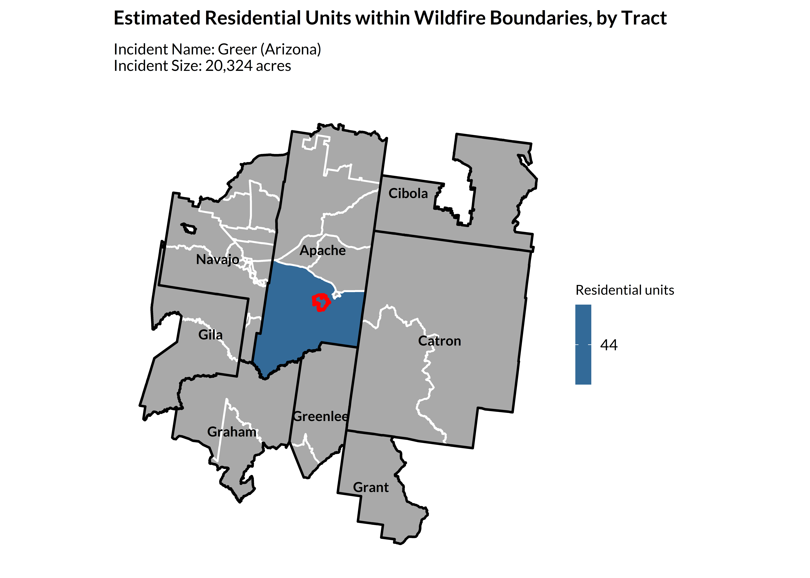

<!-- README.md is generated from README.Rmd. Please edit that file -->

# climateapi

<!-- badges: start -->
<!-- badges: end -->

The goal of `library(climateapi)` is to minimize repeated data cleaning
and wrangling to enable project teams to devote more time to substantive
analysis and inference-making. The package works toward this goal by
creating a unified interface to common datasets and data manipulation
tasks. Functions (will) support both climate-specific datasets as well
as those that are climate-adjacent.

## Installation

You can install the development version of climateapi from
[GitHub](https://github.com/) with:

``` r
# install.packages("renv")
renv::install("UI-Research/climateapi")
```

## The `climateapi` package at work:

``` r
library(climateapi)
library(urbnindicators)
library(sf)
library(tidyverse)
library(urbnthemes)
set_urbn_defaults(style = "print")
```

### ACS Housing and Demographics

Capacity for interacting with data from the American Community Survey is
housed in an adjacent package, `urbnindicators`.

Visit that package’s [webpage and
documentation](https://ui-research.github.io/urbnindicators/) to learn
more.

### Major Disaster Declarations

``` r
county_disaster_declarations = get_fema_disaster_declarations_county(api = TRUE)

county_disaster_declarations %>%
  filter(stringr::str_detect(GEOID, "^01")) %>% ## Alabama
  group_by(year_declared) %>%
    summarize(annual_incidents = sum(incidents_all, na.rm = TRUE)) %>%
  ggplot() +
    geom_col(aes(x = year_declared, y = annual_incidents)) +
    annotate("text", x = 2016.5, y = 132, label = "COVID-19 pandemic" %>% str_wrap(10), fontface = "bold") +
    labs(
      title = "COVID Results in a Spike of Counties with Disaster Declarations in 2020",
      subtitle = "Sum of major disaster declarations per Alabama county, by year",
      x = "",
      y = "") +
    theme_urbn_print()
```


### Wildfire Perimeters and Structures

``` r
## take the largest active fire
wildfire_perimeters = get_current_fire_perimeters() %>%
  dplyr::arrange(desc(incident_size_acres)) %>%
  dplyr::slice(1) %>%
  sf::st_transform(5070) %>%
  sf::st_make_valid()

## a two-item list
## the first item contains tract-level structure estimates
## the second contains the structure points
impacted_structures = get_structures(
  boundaries = wildfire_perimeters,
  geography = "tract",
  keep_structures = TRUE)
#>   |                                                                              |                                                                      |   0%  |                                                                              |==                                                                    |   2%  |                                                                              |====                                                                  |   5%  |                                                                              |====                                                                  |   6%  |                                                                              |=====                                                                 |   7%  |                                                                              |=====                                                                 |   8%  |                                                                              |======                                                                |   8%  |                                                                              |======                                                                |   9%  |                                                                              |=======                                                               |  10%  |                                                                              |=======                                                               |  11%  |                                                                              |========                                                              |  11%  |                                                                              |========                                                              |  12%  |                                                                              |=========                                                             |  13%  |                                                                              |=========                                                             |  14%  |                                                                              |==========                                                            |  14%  |                                                                              |==========                                                            |  15%  |                                                                              |===========                                                           |  15%  |                                                                              |===========                                                           |  16%  |                                                                              |============                                                          |  17%  |                                                                              |============                                                          |  18%  |                                                                              |=============                                                         |  18%  |                                                                              |=============                                                         |  19%  |                                                                              |==============                                                        |  20%  |                                                                              |==============                                                        |  21%  |                                                                              |===============                                                       |  21%  |                                                                              |===============                                                       |  22%  |                                                                              |================                                                      |  23%  |                                                                              |=================                                                     |  24%  |                                                                              |=================                                                     |  25%  |                                                                              |==================                                                    |  25%  |                                                                              |==================                                                    |  26%  |                                                                              |====================                                                  |  29%  |                                                                              |=======================                                               |  32%  |                                                                              |========================                                              |  34%  |                                                                              |=========================                                             |  35%  |                                                                              |=========================                                             |  36%  |                                                                              |==========================                                            |  37%  |                                                                              |===========================                                           |  38%  |                                                                              |==============================                                        |  44%  |                                                                              |================================                                      |  45%  |                                                                              |================================                                      |  46%  |                                                                              |=================================                                     |  47%  |                                                                              |==================================                                    |  48%  |                                                                              |===================================                                   |  50%  |                                                                              |====================================                                  |  51%  |                                                                              |====================================                                  |  52%  |                                                                              |=====================================                                 |  53%  |                                                                              |=======================================                               |  55%  |                                                                              |==========================================                            |  61%  |                                                                              |============================================                          |  62%  |                                                                              |============================================                          |  63%  |                                                                              |=============================================                         |  64%  |                                                                              |===============================================                       |  67%  |                                                                              |================================================                      |  68%  |                                                                              |================================================                      |  69%  |                                                                              |=================================================                     |  70%  |                                                                              |==================================================                    |  71%  |                                                                              |==================================================                    |  72%  |                                                                              |===================================================                   |  72%  |                                                                              |=====================================================                 |  76%  |                                                                              |======================================================                |  77%  |                                                                              |======================================================                |  78%  |                                                                              |=======================================================               |  78%  |                                                                              |=======================================================               |  79%  |                                                                              |========================================================              |  79%  |                                                                              |========================================================              |  80%  |                                                                              |=========================================================             |  81%  |                                                                              |=========================================================             |  82%  |                                                                              |===========================================================           |  84%  |                                                                              |===========================================================           |  85%  |                                                                              |============================================================          |  85%  |                                                                              |============================================================          |  86%  |                                                                              |=============================================================         |  87%  |                                                                              |==============================================================        |  88%  |                                                                              |===============================================================       |  90%  |                                                                              |================================================================      |  91%  |                                                                              |=================================================================     |  92%  |                                                                              |=================================================================     |  93%  |                                                                              |==================================================================    |  94%  |                                                                              |==================================================================    |  95%  |                                                                              |===================================================================   |  95%  |                                                                              |====================================================================  |  96%  |                                                                              |======================================================================| 100%
#> Reading layer `AZ_Structures' from data source 
#>   `C:\Users\wcurrangroome\Box\METRO Climate and Communities Practice Area\github-repository\built-environment\housing-units\usa-structures\raw\AZ\Deliverable20230502AZ\AZ_Structures.gdb' 
#>   using driver `OpenFileGDB'
#> Simple feature collection with 2701791 features and 28 fields
#> Geometry type: MULTIPOLYGON
#> Dimension:     XY
#> Bounding box:  xmin: -114.8118 ymin: 31.33255 xmax: -109.0454 ymax: 37.00252
#> Geodetic CRS:  WGS 84
#>   |                                                                              |                                                                      |   0%  |                                                                              |==                                                                    |   3%  |                                                                              |=====                                                                 |   7%  |                                                                              |======                                                                |   8%  |                                                                              |======                                                                |   9%  |                                                                              |=======                                                               |  10%  |                                                                              |========                                                              |  11%  |                                                                              |========                                                              |  12%  |                                                                              |=========                                                             |  13%  |                                                                              |=================                                                     |  24%  |                                                                              |==================                                                    |  26%  |                                                                              |=====================                                                 |  30%  |                                                                              |=======================                                               |  33%  |                                                                              |========================                                              |  34%  |                                                                              |=========================                                             |  35%  |                                                                              |==========================                                            |  37%  |                                                                              |============================                                          |  41%  |                                                                              |===============================                                       |  45%  |                                                                              |================================                                      |  46%  |                                                                              |==================================                                    |  49%  |                                                                              |===================================                                   |  50%  |                                                                              |=====================================                                 |  53%  |                                                                              |======================================                                |  54%  |                                                                              |===========================================                           |  61%  |                                                                              |==============================================                        |  65%  |                                                                              |================================================                      |  68%  |                                                                              |================================================                      |  69%  |                                                                              |=================================================                     |  71%  |                                                                              |====================================================                  |  75%  |                                                                              |=====================================================                 |  76%  |                                                                              |=======================================================               |  79%  |                                                                              |=========================================================             |  81%  |                                                                              |==========================================================            |  83%  |                                                                              |===========================================================           |  84%  |                                                                              |============================================================          |  86%  |                                                                              |==============================================================        |  88%  |                                                                              |===============================================================       |  90%  |                                                                              |================================================================      |  91%  |                                                                              |=================================================================     |  92%  |                                                                              |===================================================================   |  95%  |                                                                              |====================================================================  |  96%  |                                                                              |====================================================================  |  98%  |                                                                              |======================================================================| 100%

us_tracts_sf = tigris::tracts(cb = TRUE, year = 2023, progress_bar = FALSE) %>%
  sf::st_transform(5070)

tracts_sf = us_tracts_sf %>%
  sf::st_filter(wildfire_perimeters %>% st_transform(5070) %>% st_buffer(100000)) %>%
  dplyr::select(GEOID) %>%
  dplyr::left_join(
    impacted_structures[[1]] %>% 
      dplyr::filter(occupancy_class == "Residential") %>%
      dplyr::group_by(GEOID) %>%
      dplyr::summarize(residential_units = sum(count, na.rm = TRUE)), 
    by = "GEOID") %>%
  dplyr::mutate(county_fips = stringr::str_sub(GEOID, 1, 5)) %>%
  dplyr::left_join(
    tidycensus::fips_codes %>% 
      dplyr::mutate(county_fips = stringr::str_c(state_code, county_code)), 
    by = c("county_fips"))

counties_sf = tracts_sf %>%
  dplyr::group_by(county_fips, county) %>% 
  dplyr::summarize() %>%
  dplyr::ungroup() %>%
  dplyr::mutate(county = county %>% stringr::str_remove((" County")))

ggplot2::ggplot() +
  geom_sf(data = tracts_sf, ggplot2::aes(fill = residential_units), linewidth = .6) +
    ggplot2::scale_fill_continuous(na.value = "darkgrey") +
  ggplot2::geom_sf(data = counties_sf, fill = NA, color = "black", linewidth = .75) +
  ggplot2::geom_sf_text(data = counties_sf, color = "black", ggplot2::aes(label = county), fontface = "bold", size = 3) +
  ggplot2::geom_sf(data = wildfire_perimeters, fill = NA, color = "red", linewidth = 1) +
  ggplot2::labs(
    title = "Estimated Residential Units within Wildfire Boundaries, by Tract",
    subtitle = stringr::str_c(
      "Incident Name: ", wildfire_perimeters$incident_name, " (", 
      paste(
        tracts_sf %>% 
          dplyr::filter(!is.na(residential_units)) %>% 
          dplyr::distinct(state_name) %>%
          dplyr::pull(), collapse = ", "), ") \n",
      "Incident Size: ", (round(wildfire_perimeters$incident_size_acres, 0) %>% scales::comma()), " acres", "\n"),
    fill = "Residential units") +
  urbnthemes::theme_urbn_map()
```



### SBA Disaster Loans

``` r
sba_disaster_declarations = get_sba_loans()

sba_disaster_declarations %>%
  dplyr::mutate(
    fiscal_year = as.numeric(fiscal_year),
    sba_approved = dplyr::if_else(approved_amount_total > 0, 1, 0)) %>%
  ## some records, especially those from 2020 onwards, have NA values for approved fields
  ## for that reason, we'll only look at years predating 2020
  ## we're also going to exclude FY 2000--there are records for this year, but none
  ## for the following three years, suggesting some... irregularities in the data
  dplyr::filter(
    !is.na(sba_approved),
    fiscal_year > 2000, 
    fiscal_year < 2020) %>%
  dplyr::group_by(loan_type, sba_approved, fiscal_year) %>%
  dplyr::summarize(count = dplyr::n()) %>%
  dplyr::ungroup() %>%
  dplyr::mutate(
    fill = dplyr::case_when(
      loan_type == "business" & sba_approved == 1 ~ "Business loans approved",
      loan_type == "business" & sba_approved == 0 ~ "Business loans not approved",
      loan_type == "residential" & sba_approved == 1 ~ "Residential loans approved",
      loan_type == "residential" & sba_approved == 0 ~ "Residential loans not approved")) %>%
  ggplot2::ggplot() +
  ggplot2::geom_col(ggplot2::aes(x = fiscal_year, y = count, fill = fill)) +
  ggplot2::labs(
    title = "The Small Business Administration (SBA) Makes Many Residential Loans Post-Disaster",
    x = "Fiscal year", 
    y = "Toal loan applications") +
  ggplot2::scale_fill_manual(
    values = c(
      "Business loans approved" = palette_urbn_cyan[5] %>% as.character,
      "Business loans not approved" = palette_urbn_cyan[3] %>% as.character,
      "Residential loans approved" = palette_urbn_yellow[5] %>% as.character,
      "Residential loans not approved" = palette_urbn_yellow[3] %>% as.character)) +
  ggplot2::scale_y_continuous(labels = scales::comma) +
  ggplot2::scale_x_continuous(breaks = seq(2004, 2019, 3)) +
  ggplot2::guides(fill = ggplot2::guide_legend(nrow = 2, byrow = TRUE))
```


### County Business Patterns

``` r
business_patterns = get_business_patterns()

business_patterns %>%
  dplyr::filter(employee_size_range_code == "001") %>% ## all sizes
  dplyr::group_by(state, county) %>%
    dplyr::mutate(
      industry_share_payroll = annual_payroll / annual_payroll[industry == "total"]) %>%
    dplyr::filter(industry != "total") %>%
  dplyr::ungroup() %>%
  dplyr::filter(state == "01", county == "001") %>%
  dplyr::mutate(industry = industry %>% janitor::make_clean_names(case = "sentence") %>% stringr::str_wrap(40)) %>%
  ggplot2::ggplot() +
    ggplot2::geom_col(ggplot2::aes(y = stats::reorder(industry, industry_share_payroll), x = industry_share_payroll)) +
    ggplot2::labs(
      x = "Share of total payroll",
       y = "Industry",
       title = "Autauga County, AL's Industries (NAICS Codes) by Payroll Share")
```


### Government Expenses

``` r
government_finances = get_government_finances()

government_finances %>%
  dplyr::filter(state_code == "01", county_code == "001") %>%
  dplyr::group_by(government_type) %>%
    dplyr::summarize(
      amount_millions = sum(amount_thousands, na.rm = TRUE) / 1000,
      count = dplyr::n()) %>%
  ggplot2::ggplot(aes(y = stats::reorder(government_type, amount_millions) %>% stringr::str_wrap(30), x = amount_millions)) +
  ggplot2::geom_col() +
  ggplot2::geom_text(ggplot2::aes(label = stringr::str_c("(N = ", count, ")")), hjust = -.25) +
  ggplot2::labs(x = "Total annual expenditures (millions, USD)",
       y = "",
       title = "Autauga County, AL's Expenditures by Government Unit Class",
       subtitle = "Government unit counts in parentheses") +
  ggplot2::scale_x_continuous(labels = scales::dollar, limits = c(0, 500)) +
  ggplot2::theme(panel.grid.major = ggplot2::element_blank())
```


### LEHD Origin Destination Employment Statistics (LODES)

``` r
lodes = get_lodes(
    lodes_type = "od",
    jobs_type = "all",
    states = "AL",
    years = 2022,
    geography = "tract",
    ## for simplicity, considering only workers who live and work in AL
    state_part = "main") %>%
  ## federal jobs are broken out separately in case users need to standardize
  ## all-jobs counts over time, but this doesn't apply here
  dplyr::filter(job_type == "all")

al_tracts = us_tracts_sf %>%
  dplyr::filter(GEOID %>% str_sub(1,2) == "01") %>%
  dplyr::select(GEOID) %>%
  sf::st_transform(5070)

al_centroids = al_tracts %>%
  sf::st_centroid() %>%
  sf::st_transform(5070) %>%
  sf::st_coordinates() %>%
  tibble::as_tibble() %>%
  cbind(al_tracts$GEOID) %>%
  dplyr::rename(
    x = X,
    y = Y,
    GEOID = 3)

major_al_cities = tidycensus::get_acs(
    geography = "place",
    variables = c(population = "B01003_001"),
    year = 2022,
    output = "wide",
    state = "AL",
    geometry = TRUE) %>%
  dplyr::slice_max(populationE, n = 5) %>%
  dplyr::transmute(
    NAME = NAME %>% 
      stringr::str_remove_all("CDP|city|town|,|Alabama") %>% 
      stringr::str_squish() %>% 
      stringr::str_trim())
#>   |                                                                              |                                                                      |   0%  |                                                                              |======                                                                |   9%  |                                                                              |====================                                                  |  28%  |                                                                              |=================================                                     |  47%  |                                                                              |===============================================                       |  67%  |                                                                              |============================================================          |  86%  |                                                                              |======================================================================| 100%

lodes %>%
  dplyr::select(dplyr::matches("GEOID"), total_jobs) %>%
  dplyr::left_join(al_centroids, by = c("h_GEOID" = "GEOID")) %>%
  dplyr::left_join(al_centroids %>% dplyr::rename(xend = x, yend = y), by = c("w_GEOID" = "GEOID")) %>%
  filter(total_jobs > 20) %>%
  ggplot() +
    geom_sf(data = al_tracts, fill = "lightgrey", color = "darkgrey", linewidth = .5) +
    geom_segment(
      aes(x = x, y = y, xend = xend, yend = yend), color = palette_urbn_main[1], alpha = .1) +
    geom_sf(data = major_al_cities, fill = NA, color = "black") +
    geom_sf_text(data = major_al_cities, aes(label = NAME), size = 3, , fontface = "bold", color = "black", vjust = -2) +
    theme_urbn_map() +
  labs(title = "Employment Commuting Patterns by Tract in Alabama (2022)")
```


