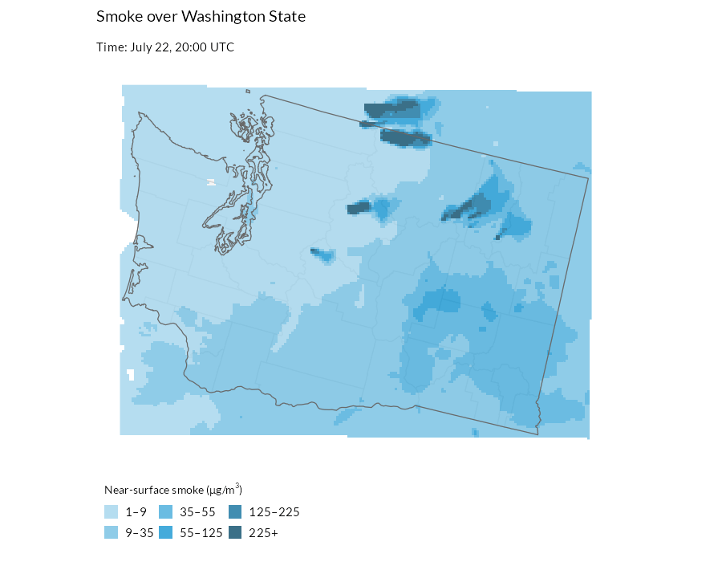

`get_hrrr_smoke()` retrieves hourly near-surface wildfire smoke concentrations
from NOAA's High-Resolution Rapid Refresh (HRRR) model for any area in the
conterminous United States, on a 3-kilometer grid. Here we build a two-week
look-behind animation of smoke over Washington State: where smoke traveled,
when it arrived, and how severe it was at ground level.


``` r
library(climateapi)
library(dplyr)
library(stringr)
library(sf)
library(ggplot2)
library(urbnthemes)
library(gganimate)
```

## Pulling two weeks of hourly smoke

We ask for the "surface" variable -- smoke mass density 8 meters above ground,
in micrograms per cubic meter, the quantity most comparable to PM2.5 air
quality readings. The result is a `terra::SpatRaster` with one layer per
retrieved hour, timestamped in UTC. Three-hourly steps (eight frames per day)
keep the animation responsive over a two-week window; pass `hours = 0:23` for
the full hourly record.


``` r
projection = 5070

area_of_interest = tigris::states(cb = TRUE, year = 2023, progress_bar = FALSE) %>%
  filter(str_detect(NAME, "Washington")) %>%
  st_transform(projection)

smoke_data = get_hrrr_smoke(
  geometries = area_of_interest,
  start_date = Sys.Date() - 14,
  end_date = Sys.Date(),
  variable = "surface",
  hours = seq(0, 21, by = 3))
#> 
|---------|---------|---------|---------|
=========================================
                                          

smoke_data
#> class       : SpatRaster 
#> size        : 150, 200, 117  (nrow, ncol, nlyr)
#> resolution  : 3000, 3000  (x, y)
#> extent      : -2036020, -1436020, 991193.8, 1441194  (xmin, xmax, ymin, ymax)
#> coord. ref. : +proj=lcc +lat_0=38.5 +lon_0=-97.5 +lat_1=38.5 +lat_2=38.5 +x_0=0 +y_0=0 +R=6371229 +units=m +no_defs 
#> source(s)   : memory
#> names       :  2026-~00:00,  2026-~03:00,  2026-~06:00,  2026-~09:00,  2026-~12:00,  2026-~15:00, ... 
#> min values  : 2.988507e-15, 1.077663e-16, 1.053054e-16, 9.260972e-17, 3.603632e-14, 2.684881e-08, ... 
#> max values  : 4.555040e+03, 4.114960e+03, 1.005960e+03, 6.965000e+02, 1.654240e+03, 1.312560e+03, ... 
#> time        : 2026-07-23 to 2026-08-06 12:00:00 UTC (117 steps)
```

## Preparing the data for mapping

The raster arrives in the HRRR model's native projection; we reproject it to
match the vector layers, then melt it into a one-row-per-cell-per-hour tibble,
which is the shape `gganimate` needs.

Rather than mapping concentrations to a continuous color ramp, we bin them at
the EPA's 24-hour PM2.5 Air Quality Index breakpoints (rounded for display):
9, 35, 55, 125, and 225 micrograms per cubic meter mark the transitions from
"good" air through "moderate", "unhealthy for sensitive groups", "unhealthy",
"very unhealthy", and "hazardous". Cells below 1 microgram per cubic meter are
dropped entirely so that clean air stays transparent and the basemap shows
through.


``` r
smoke_data_projected = terra::project(smoke_data, paste0("EPSG:", projection))

counties_context = tigris::counties(
    cb = TRUE, year = 2023, state = "WA", progress_bar = FALSE) %>%
  st_transform(projection) %>%
  select(NAME)

smoke_breaks = c(1, 9, 35, 55, 125, 225, Inf)
smoke_labels = c("1–9", "9–35", "35–55", "55–125", "125–225", "225+")
smoke_colors = palette_urbn_cyan[2:7]
names(smoke_colors) = smoke_labels

smoke_df = smoke_data_projected %>%
  as.data.frame(xy = TRUE, wide = FALSE) %>%
  as_tibble() %>%
  left_join(
    tibble(
      layer = names(smoke_data_projected),
      timestamp = terra::time(smoke_data_projected)),
    by = "layer",
    relationship = "many-to-one") %>%
  rename(smoke_ug_m3 = values) %>%
  mutate(
    smoke_level = cut(
      smoke_ug_m3,
      breaks = smoke_breaks,
      labels = smoke_labels,
      right = FALSE)) %>%
  filter(!is.na(smoke_level))
```

## Animating

The plot is an ordinary ggplot -- light-filled counties first, the smoke
raster on top, an outline-only state border last -- plus
`transition_time(timestamp)`, which turns the hourly layers into frames.
`animate()` renders one frame per model hour, and `anim_save()` writes the
result next to the vignette's other figures so it can be embedded below.


``` r
smoke_animation = ggplot() +
  geom_sf(data = counties_context, fill = "#f5f5f5", color = "#d2d2d2", linewidth = 0.35) +
  geom_raster(data = smoke_df, aes(x = x, y = y, fill = smoke_level), alpha = 0.8) +
  geom_sf(data = area_of_interest, fill = NA, color = "#696969", linewidth = 0.35) +
  scale_fill_manual(
    values = smoke_colors,
    ## keep every severity bin in the legend even in frames where no cell
    ## reaches it, so the legend does not change size between frames
    drop = FALSE,
    name = expression("Near-surface smoke (" * mu * "g/m"^3 * ")")) +
  labs(
    title = "Smoke over Washington State",
    subtitle = "Time: {format(frame_time, '%B %d, %H:%M UTC')}") +
  urbnthemes::theme_urbn_map() +
  theme(
    legend.position = "bottom",
    legend.justification = "left",
    legend.direction = "horizontal",
    legend.title.position = "top",
    legend.key.spacing.x = unit(0.25, "line")) +
  transition_time(timestamp) +
  ease_aes("linear")

smoke_gif = animate(
  smoke_animation,
  renderer = gifski_renderer(),
  device = "ragg_png",
  nframes = n_distinct(smoke_df$timestamp),
  fps = 8,
  width = 900,
  height = 700,
  units = "px",
  res = 120,
  end_pause = 8)

anim_save("figure/get_hrrr_smoke-animation.gif", smoke_gif)
```



The model's spatial patterns -- where plumes travel and pool -- are generally
reliable, but the concentrations are estimates driven by satellite fire
detections, so they can be biased where fire emission estimates are wrong.
For observed ground truth at specific locations, compare against PM2.5
monitor readings (for example, via the AirNow API), which share the same
unit.
