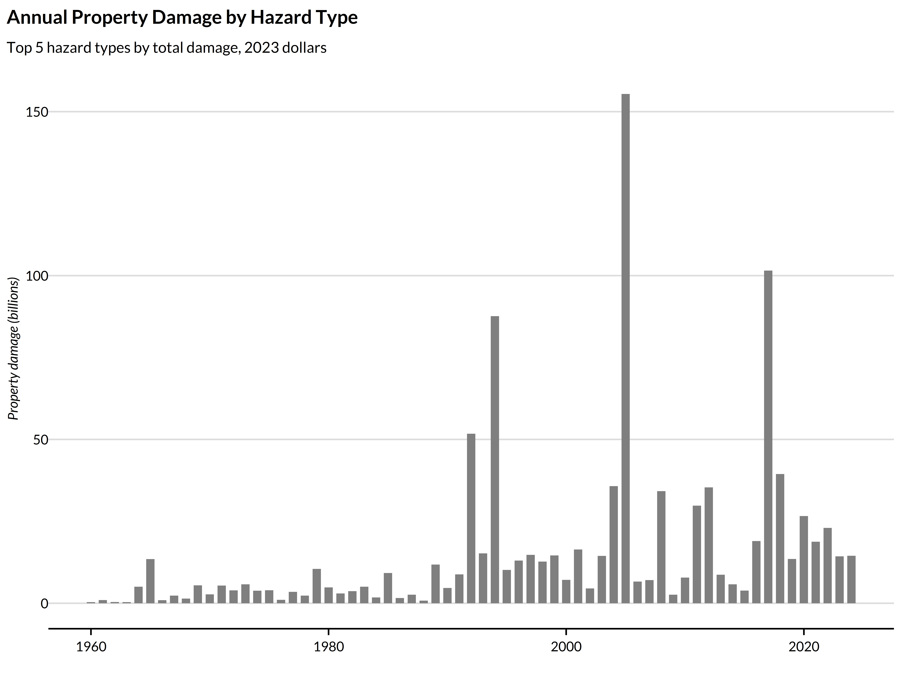
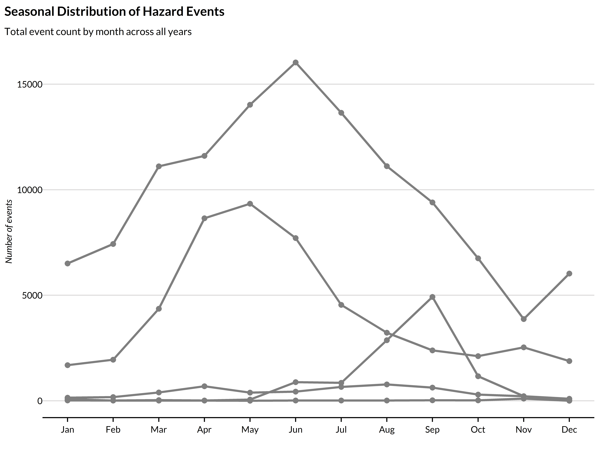
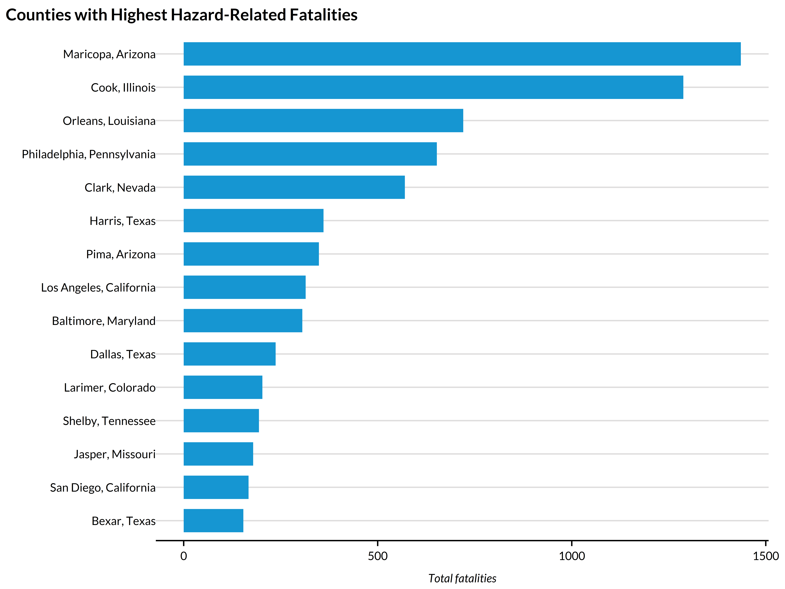

## Overview

The `get_sheldus()` function provides access to county-level hazard event data from the Spatial Hazard Events and Losses Database for the United States (SHELDUS). This database tracks property damage, crop damage, fatalities, and injuries from natural hazards across all US counties.

## Data source

SHELDUS is maintained by Arizona State University's Center for Emergency Management and Homeland Security. The database compiles hazard event data from multiple sources including NOAA Storm Events, the National Climatic Data Center, and other federal agencies.

Access to SHELDUS requires a subscription. See [https://cemhs.asu.edu/sheldus](https://cemhs.asu.edu/sheldus) for more information.

## Loading the data


``` r
library(climateapi)
library(tidyverse)
library(sf)
library(urbnthemes)

set_urbn_defaults(style = "print")
```


``` r
sheldus <- get_sheldus()
```


```
#> 
  |                                                                           
  |                                                                     |   0%
  |                                                                           
  |                                                                     |   1%
  |                                                                           
  |=                                                                    |   1%
  |                                                                           
  |=                                                                    |   2%
  |                                                                           
  |==                                                                   |   2%
  |                                                                           
  |==                                                                   |   3%
  |                                                                           
  |==                                                                   |   4%
  |                                                                           
  |===                                                                  |   4%
  |                                                                           
  |===                                                                  |   5%
  |                                                                           
  |====                                                                 |   5%
  |                                                                           
  |====                                                                 |   6%
  |                                                                           
  |=====                                                                |   7%
  |                                                                           
  |=====                                                                |   8%
  |                                                                           
  |======                                                               |   8%
  |                                                                           
  |======                                                               |   9%
  |                                                                           
  |=======                                                              |   9%
  |                                                                           
  |=======                                                              |  10%
  |                                                                           
  |=======                                                              |  11%
  |                                                                           
  |========                                                             |  11%
  |                                                                           
  |========                                                             |  12%
  |                                                                           
  |=========                                                            |  12%
  |                                                                           
  |=========                                                            |  13%
  |                                                                           
  |=========                                                            |  14%
  |                                                                           
  |==========                                                           |  14%
  |                                                                           
  |==========                                                           |  15%
  |                                                                           
  |===========                                                          |  15%
  |                                                                           
  |===========                                                          |  16%
  |                                                                           
  |===========                                                          |  17%
  |                                                                           
  |============                                                         |  17%
  |                                                                           
  |============                                                         |  18%
  |                                                                           
  |=============                                                        |  18%
  |                                                                           
  |=============                                                        |  19%
  |                                                                           
  |=============                                                        |  20%
  |                                                                           
  |==============                                                       |  20%
  |                                                                           
  |==============                                                       |  21%
  |                                                                           
  |===============                                                      |  21%
  |                                                                           
  |===============                                                      |  22%
  |                                                                           
  |================                                                     |  23%
  |                                                                           
  |================                                                     |  24%
  |                                                                           
  |=================                                                    |  24%
  |                                                                           
  |=================                                                    |  25%
  |                                                                           
  |==================                                                   |  26%
  |                                                                           
  |==================                                                   |  27%
  |                                                                           
  |===================                                                  |  27%
  |                                                                           
  |===================                                                  |  28%
  |                                                                           
  |====================                                                 |  28%
  |                                                                           
  |====================                                                 |  29%
  |                                                                           
  |====================                                                 |  30%
  |                                                                           
  |=====================                                                |  30%
  |                                                                           
  |=====================                                                |  31%
  |                                                                           
  |======================                                               |  31%
  |                                                                           
  |======================                                               |  32%
  |                                                                           
  |=======================                                              |  33%
  |                                                                           
  |=======================                                              |  34%
  |                                                                           
  |========================                                             |  34%
  |                                                                           
  |========================                                             |  35%
  |                                                                           
  |=========================                                            |  36%
  |                                                                           
  |=========================                                            |  37%
  |                                                                           
  |==========================                                           |  37%
  |                                                                           
  |==========================                                           |  38%
  |                                                                           
  |===========================                                          |  39%
  |                                                                           
  |===========================                                          |  40%
  |                                                                           
  |============================                                         |  40%
  |                                                                           
  |============================                                         |  41%
  |                                                                           
  |=============================                                        |  41%
  |                                                                           
  |=============================                                        |  42%
  |                                                                           
  |=============================                                        |  43%
  |                                                                           
  |==============================                                       |  43%
  |                                                                           
  |==============================                                       |  44%
  |                                                                           
  |===============================                                      |  44%
  |                                                                           
  |===============================                                      |  45%
  |                                                                           
  |===============================                                      |  46%
  |                                                                           
  |================================                                     |  46%
  |                                                                           
  |================================                                     |  47%
  |                                                                           
  |=================================                                    |  47%
  |                                                                           
  |=================================                                    |  48%
  |                                                                           
  |=================================                                    |  49%
  |                                                                           
  |==================================                                   |  49%
  |                                                                           
  |==================================                                   |  50%
  |                                                                           
  |===================================                                  |  50%
  |                                                                           
  |===================================                                  |  51%
  |                                                                           
  |====================================                                 |  52%
  |                                                                           
  |====================================                                 |  53%
  |                                                                           
  |=====================================                                |  53%
  |                                                                           
  |=====================================                                |  54%
  |                                                                           
  |======================================                               |  54%
  |                                                                           
  |======================================                               |  55%
  |                                                                           
  |======================================                               |  56%
  |                                                                           
  |=======================================                              |  56%
  |                                                                           
  |=======================================                              |  57%
  |                                                                           
  |========================================                             |  57%
  |                                                                           
  |========================================                             |  58%
  |                                                                           
  |========================================                             |  59%
  |                                                                           
  |=========================================                            |  59%
  |                                                                           
  |=========================================                            |  60%
  |                                                                           
  |==========================================                           |  60%
  |                                                                           
  |==========================================                           |  61%
  |                                                                           
  |==========================================                           |  62%
  |                                                                           
  |===========================================                          |  62%
  |                                                                           
  |===========================================                          |  63%
  |                                                                           
  |============================================                         |  63%
  |                                                                           
  |============================================                         |  64%
  |                                                                           
  |=============================================                        |  65%
  |                                                                           
  |=============================================                        |  66%
  |                                                                           
  |==============================================                       |  66%
  |                                                                           
  |==============================================                       |  67%
  |                                                                           
  |===============================================                      |  68%
  |                                                                           
  |===============================================                      |  69%
  |                                                                           
  |================================================                     |  69%
  |                                                                           
  |================================================                     |  70%
  |                                                                           
  |=================================================                    |  70%
  |                                                                           
  |=================================================                    |  71%
  |                                                                           
  |=================================================                    |  72%
  |                                                                           
  |==================================================                   |  72%
  |                                                                           
  |==================================================                   |  73%
  |                                                                           
  |===================================================                  |  73%
  |                                                                           
  |===================================================                  |  74%
  |                                                                           
  |====================================================                 |  75%
  |                                                                           
  |====================================================                 |  76%
  |                                                                           
  |=====================================================                |  76%
  |                                                                           
  |=====================================================                |  77%
  |                                                                           
  |======================================================               |  78%
  |                                                                           
  |======================================================               |  79%
  |                                                                           
  |=======================================================              |  79%
  |                                                                           
  |=======================================================              |  80%
  |                                                                           
  |========================================================             |  80%
  |                                                                           
  |========================================================             |  81%
  |                                                                           
  |========================================================             |  82%
  |                                                                           
  |=========================================================            |  82%
  |                                                                           
  |=========================================================            |  83%
  |                                                                           
  |==========================================================           |  83%
  |                                                                           
  |==========================================================           |  84%
  |                                                                           
  |==========================================================           |  85%
  |                                                                           
  |===========================================================          |  85%
  |                                                                           
  |===========================================================          |  86%
  |                                                                           
  |============================================================         |  86%
  |                                                                           
  |============================================================         |  87%
  |                                                                           
  |============================================================         |  88%
  |                                                                           
  |=============================================================        |  88%
  |                                                                           
  |=============================================================        |  89%
  |                                                                           
  |==============================================================       |  89%
  |                                                                           
  |==============================================================       |  90%
  |                                                                           
  |==============================================================       |  91%
  |                                                                           
  |===============================================================      |  91%
  |                                                                           
  |===============================================================      |  92%
  |                                                                           
  |================================================================     |  92%
  |                                                                           
  |================================================================     |  93%
  |                                                                           
  |=================================================================    |  94%
  |                                                                           
  |=================================================================    |  95%
  |                                                                           
  |==================================================================   |  95%
  |                                                                           
  |==================================================================   |  96%
  |                                                                           
  |===================================================================  |  96%
  |                                                                           
  |===================================================================  |  97%
  |                                                                           
  |===================================================================  |  98%
  |                                                                           
  |==================================================================== |  98%
  |                                                                           
  |==================================================================== |  99%
  |                                                                           
  |=====================================================================|  99%
  |                                                                           
  |=====================================================================| 100%
```

## Data structure

Each row represents a unique combination of county, year, month, and hazard type. Only county-month-hazard combinations with recorded events are included.

Key variables include:

- `unique_id`: Unique identifier for each observation
- `GEOID`: Five-digit county FIPS code
- `year` and `month`: Temporal identifiers
- `hazard`: Type of hazard event (e.g., "Flooding", "Hurricane/Tropical Storm")
- `damage_property`: Property damage in 2023 inflation-adjusted dollars
- `damage_crop`: Crop damage in 2023 inflation-adjusted dollars
- `fatalities` and `injuries`: Human impacts
- `records`: Number of individual events aggregated into the observation

## Example analyses

### Hazard types in the database


``` r
sheldus |>
  distinct(hazard) |>
  arrange(hazard) |>
  pull(hazard)
#>  [1] "Avalanche"                  "Coastal"                   
#>  [3] "Drought"                    "Earthquake"                
#>  [5] "Flooding"                   "Fog"                       
#>  [7] "Hail"                       "Heat"                      
#>  [9] "Hurricane/Tropical Storm"   "Landslide"                 
#> [11] "Lightning"                  "Severe Storm/Thunder Storm"
#> [13] "Tornado"                    "Tsunami/Seiche"            
#> [15] "Volcano"                    "Wildfire"                  
#> [17] "Wind"                       "Winter Weather"
```

### Annual property damage by hazard type


``` r
df1 <- sheldus |>
  summarize(
    .by = c(year, hazard),
    total_damage = sum(damage_property, na.rm = TRUE) / 1e9)

top_hazards <- df1 |>
  summarize(
    .by = hazard,
    total = sum(total_damage, na.rm = TRUE)) |>
  slice_max(total, n = 5) |>
  pull(hazard)

df1 |>
  filter(hazard %in% top_hazards) |>
  ggplot(aes(x = year, y = total_damage, fill = hazard)) +
  geom_col() +
  scale_fill_manual(values = c(
    palette_urbn_main[1:4], palette_urbn_cyan[5])) +
  labs(
    title = "Annual Property Damage by Hazard Type",
    subtitle = "Top 5 hazard types by total damage, 2023 dollars",
    x = "",
    y = "Property damage (billions)",
    fill = "Hazard type")
```



### Geographic distribution of flood damage


``` r
flood_damage <- sheldus |>
  filter(hazard == "Flooding") |>
  summarize(
    .by = GEOID,
    total_damage = sum(damage_property, na.rm = TRUE))

counties_sf <- tigris::counties(cb = TRUE, year = 2022, progress_bar = FALSE) |>
  st_transform(5070) |>
  filter(!STATEFP %in% c("02", "15", "72", "78", "66", "60", "69"))

flood_map <- counties_sf |>
  left_join(flood_damage, by = "GEOID") |>
  mutate(
    damage_category = case_when(
      is.na(total_damage) | total_damage == 0 ~ "No recorded damage",
      total_damage < 1e6 ~ "< $1M",
      total_damage < 10e6 ~ "$1M - $10M",
      total_damage < 100e6 ~ "$10M - $100M",
      TRUE ~ "> $100M"),
    damage_category = factor(
      damage_category,
      levels = c("No recorded damage", "< $1M", "$1M - $10M", "$10M - $100M", "> $100M")))

ggplot(flood_map) +
  geom_sf(aes(fill = damage_category), color = NA) +
  scale_fill_manual(values = c(
    "No recorded damage" = "grey90",
    "< $1M" = palette_urbn_cyan[1],
    "$1M - $10M" = palette_urbn_cyan[3],
    "$10M - $100M" = palette_urbn_cyan[5],
    "> $100M" = palette_urbn_cyan[7])) +
  labs(
    title = "Cumulative Flood Damage by County",
    subtitle = "Total property damage from flooding events, 2023 dollars",
    fill = "Total damage") +
  theme_urbn_map()
```


### Seasonal patterns in hazard events


``` r
seasonal <- sheldus |>
  filter(hazard %in% top_hazards) |>
  summarize(
    .by = c(month, hazard),
    total_events = sum(records, na.rm = TRUE))

ggplot(seasonal, aes(x = month, y = total_events, color = hazard)) +
  geom_line(linewidth = 1) +
  geom_point(size = 2) +
  scale_x_continuous(breaks = 1:12, labels = month.abb) +
  scale_color_manual(values = c(
    palette_urbn_main[1:4], palette_urbn_cyan[5])) +
  labs(
    title = "Seasonal Distribution of Hazard Events",
    subtitle = "Total event count by month across all years",
    x = "",
    y = "Number of events",
    color = "Hazard type")
```



### Counties with highest fatalities


``` r
high_fatality_counties <- sheldus |>
  summarize(
    .by = c(GEOID, state_name, county_name),
    total_fatalities = sum(fatalities, na.rm = TRUE)) |>
  slice_max(total_fatalities, n = 15)

high_fatality_counties |>
  mutate(
    county_label = str_c(county_name, ", ", state_name),
    county_label = fct_reorder(county_label, total_fatalities)) |>
  ggplot(aes(y = county_label, x = total_fatalities)) +
  geom_col() +
  labs(
    title = "Counties with Highest Hazard-Related Fatalities",
    x = "Total fatalities",
    y = "")
```



### Linking with census data

The county-level structure makes it straightforward to join with demographic data.


``` r
county_demographics <- tidycensus::get_acs(
  geography = "county",
  variables = c(
    median_income = "B19013_001",
    total_pop = "B01003_001"),
  year = 2022,
  output = "wide")

county_hazard_summary <- sheldus |>
  filter(year >= 2018) |>
  summarize(
    .by = GEOID,
    total_damage = sum(damage_property, na.rm = TRUE),
    total_events = sum(records, na.rm = TRUE)) |>
  left_join(county_demographics, by = "GEOID") |>
  mutate(damage_per_capita = total_damage / total_popE)
```

## See also

- `get_fema_disaster_declarations()`: FEMA disaster declarations
- `get_nfip_claims()`: National Flood Insurance Program claims data
- `get_wildfire_burn_zones()`: Wildfire burn zone disasters
