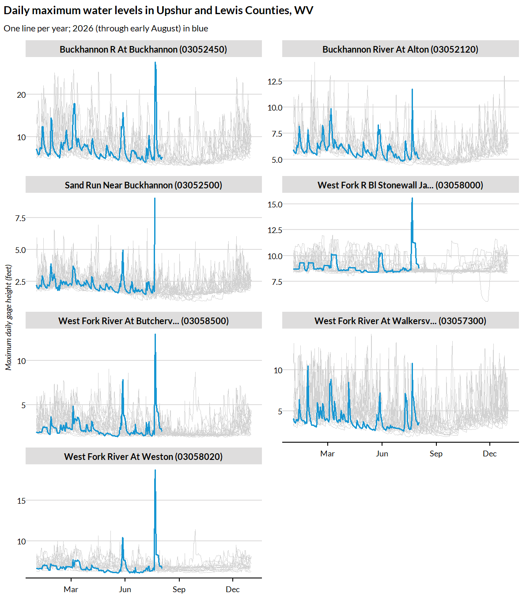

`get_usgs_gage()` pulls daily stream-gage readings for every USGS stream gage
in one or more counties, attaching each gage's name, county, coordinates, and
drainage area to every reading. Under the hood it uses the USGS Water Data
APIs via the `dataRetrieval` package. Here we ask a concrete question: at the
stream gages in Upshur and Lewis Counties, West Virginia, how do daily maximum
water levels in 2026 compare against each gage's own history?


``` r
library(climateapi)
library(dplyr)
library(ggplot2)
library(lubridate)
library(stringr)
library(urbnthemes)

set_urbn_defaults(style = "print")
```

## Pulling daily maximum gage heights

Counties are identified by their five-digit FIPS codes: "54097" is Upshur
County and "54041" is Lewis County. The daily maximum height is computed from
each gage's continuous (15-minute) record -- a download of a minute or more
per gage -- so each gage's aggregated daily maxima are cached to their own
parquet file: an interrupted pull resumes where it left off, and a re-run
reads entirely from disk. We cache under the standard per-user cache
directory; any persistent directory works.


``` r
gage_history = get_usgs_gage(
  counties = c("54097", "54041"),
  measure = "height",
  statistic = "daily_max",
  cache_dir = tools::R_user_dir("climateapi", which = "cache"))

gage_history %>% dplyr::glimpse()
#> Rows: 41,572
#> Columns: 11
#> $ site_number        <chr> "03052120", "03052120", "03052120", "03052120", "03…
#> $ gage_name          <chr> "BUCKHANNON RIVER AT ALTON, WV", "BUCKHANNON RIVER …
#> $ county_geoid       <chr> "54097", "54097", "54097", "54097", "54097", "54097…
#> $ county_name        <chr> "Upshur", "Upshur", "Upshur", "Upshur", "Upshur", "…
#> $ state_abbreviation <chr> "WV", "WV", "WV", "WV", "WV", "WV", "WV", "WV", "WV…
#> $ latitude           <dbl> 38.81964, 38.81964, 38.81964, 38.81964, 38.81964, 3…
#> $ longitude          <dbl> -80.21389, -80.21389, -80.21389, -80.21389, -80.213…
#> $ drainage_area_sqmi <dbl> 94.7, 94.7, 94.7, 94.7, 94.7, 94.7, 94.7, 94.7, 94.…
#> $ date               <date> 2011-10-12, 2011-10-13, 2011-10-14, 2011-10-15, 20…
#> $ value              <dbl> 5.64, 5.66, 7.89, 7.52, 6.65, 6.22, 5.95, 5.77, 5.8…
#> $ approval_status    <chr> "approved", "approved", "approved", "approved", "ap…
```

## How does 2026 compare to each gage's history?

We overlay one line per year at each gage, aligning every year on a shared
January-through-December axis. The 2026 line (partial, through early August)
is drawn in the Urban Institute's main blue over each gage's earlier years in
light gray.


``` r
plot_data = gage_history %>%
  dplyr::mutate(
    year = lubridate::year(date),
    ## a common x-axis date so that years plot atop one another; the (arbitrary)
    ## year 2026 is used only for axis labeling
    common_date = as.Date(lubridate::yday(date) - 1, origin = "2026-01-01"),
    ## shorten station names so facet labels fit their strips
    gage_label = gage_name %>%
      stringr::str_to_title() %>%
      stringr::str_remove(",?\\s*(Wv|WV)$") %>%
      stringr::str_trunc(30) %>%
      stringr::str_c(" (", site_number, ")"))

plot_data %>%
  ggplot(aes(x = common_date, y = value, group = year)) +
  geom_line(
    data = ~ dplyr::filter(.x, year != 2026),
    color = palette_urbn_gray[5],
    linewidth = 0.3) +
  geom_line(
    data = ~ dplyr::filter(.x, year == 2026),
    color = palette_urbn_main[["cyan"]],
    linewidth = 0.7) +
  facet_wrap(~ gage_label, ncol = 2, scales = "free_y") +
  scale_x_date(date_breaks = "3 months", date_labels = "%b") +
  labs(
    x = NULL,
    y = "Maximum daily gage height (feet)",
    title = "Daily maximum water levels in Upshur and Lewis Counties, WV",
    subtitle = "One line per year; 2026 (through early August) in blue")
```



Because each series reflects the maximum reading on each day, short-lived
flood crests are visible even when they lasted only hours. Note that the
vertical axis varies by gage: gage height is measured relative to a
gage-specific datum, so heights are comparable across years at the same gage
but not across gages.
