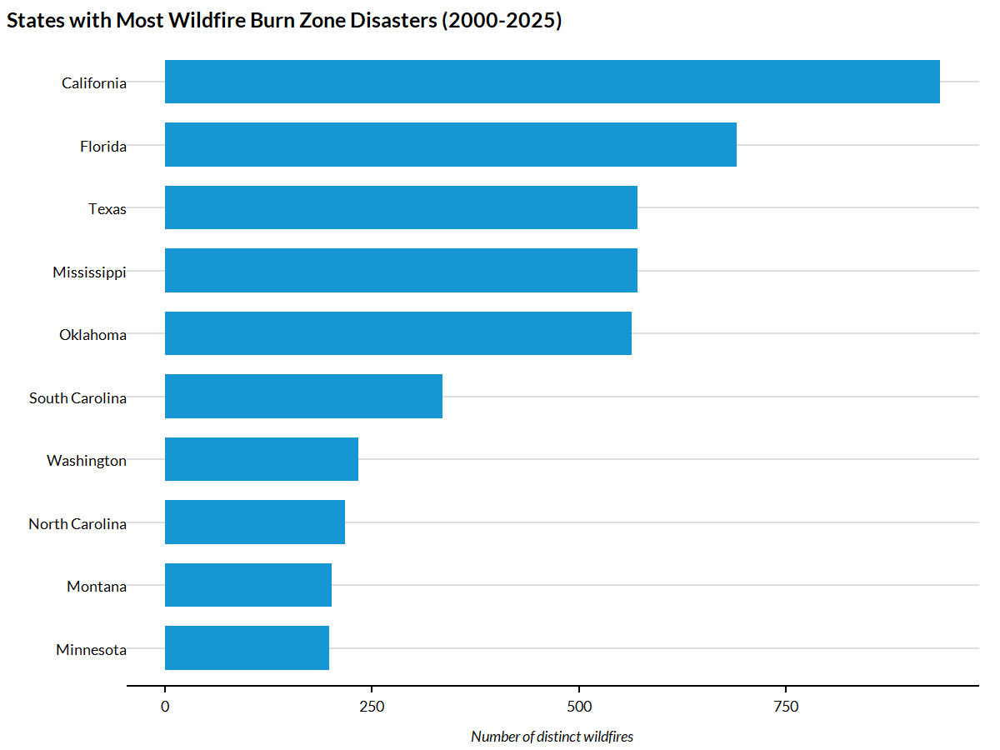
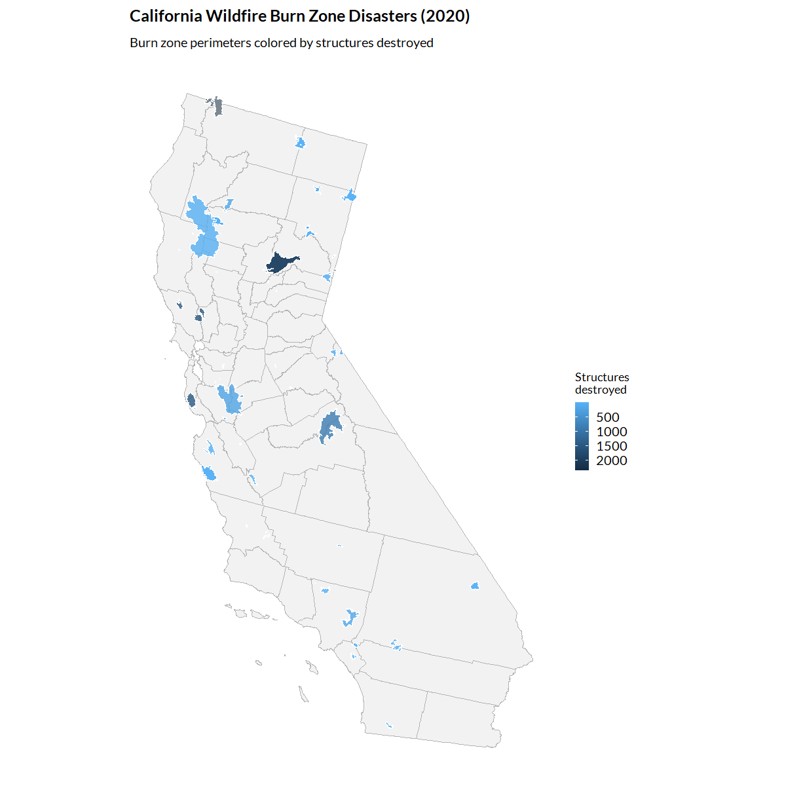
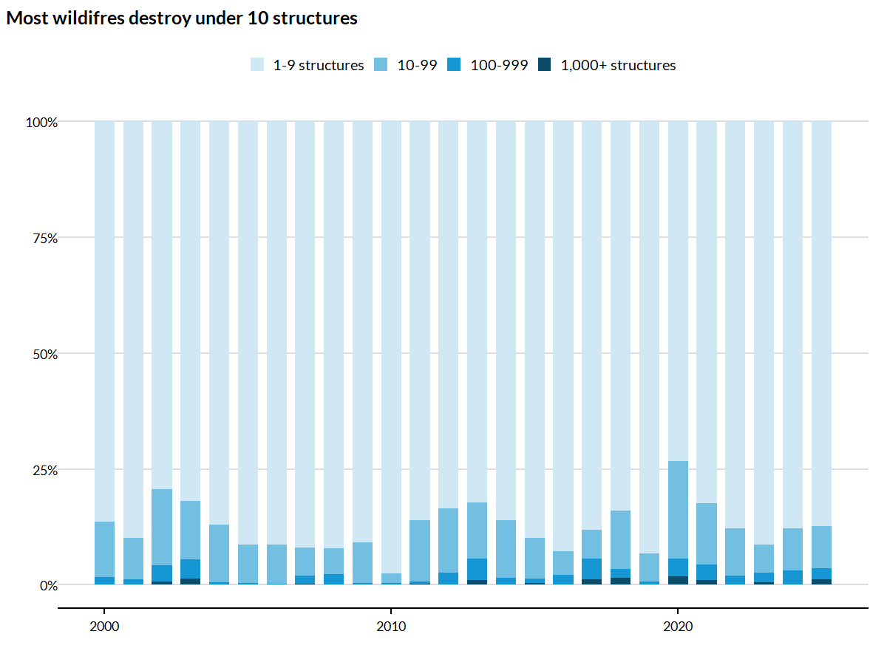

## Overview

The `get_wildfire_burn_zones()` function provides access to a harmonized dataset of wildfire burn zone disasters in the United States from 2000-2025. 

## Data sources and methodology

This dataset combines six authoritative wildfire data sources to identify wildfires that burned near communities and resulted in civilian fatalities, destroyed structures, or received federal disaster relief. These sources are:

- **FIRED (Fire Event Delineation)**: Satellite-derived fire perimeters
- **MTBS (Monitoring Trends in Burn Severity)**: Burn severity and perimeters for large fires
- **NIFC (National Interagency Fire Center)**: Official fire incident data
- **ICS-209 (Incident Status Summary)**: Incident management records
- **RedBook**: Historical wildfire statistics
- **FEMA**: Federal disaster declarations

Wildfires are classified as "disasters" if they:

1. Burned near a community AND
2. Resulted in at least one of:
   - Civilian fatality
   - Destroyed structure
   - Federal disaster relief

These data are described and provided in association with the journal article: Wilner, L.B., Piepmeier, L., Gordon, M. et al. Two and a half decades of United States wildfire burn zone disaster data, 2000-2025. Sci Data 12, 1948 (2025). https://doi.org/10.1038/s41597-025-06226-8. 

## Loading the data


``` r
library(climateapi)
library(tidyverse)
library(sf)
library(urbnthemes)

set_urbn_defaults(style = "print")
```


``` r
burn_zones <- get_wildfire_burn_zones()
```


## Data structure

Each row in the dataset represents a single wildfire burn zone disaster.


``` r
glimpse(burn_zones)
#> Rows: 6,911
#> Columns: 18
#> $ wildfire_id                          <dbl> 1, 2, 3, 4, 5, 6, 7, 8, 9, 10, 11, 12, 13, 14, 15, 16, 17, 18, 19, 20, 21, 22, 23, 24, 25, 26, 27, 28, 29, 30, 31, 32, 33,…
#> $ id_fema                              <chr> NA, "FM-5491-OK", NA, NA, "FM-5178-FL", NA, NA, "FM-5086-AZ", NA, "FM-5319-NV", NA, NA, NA, NA, NA, "FM-5445-CA", NA, NA, …
#> $ year                                 <int> 2018, 2024, 2017, 2014, 2017, 2019, 2016, 2015, 2017, 2020, 2020, 2014, 2017, 2016, 2022, 2022, 2022, 2020, 2022, 2020, 20…
#> $ wildfire_name                        <chr> "DONNELL", "57", "GARFIELD RD", "TYONEK", "30TH AVE", "G18", "WILLARD", "KEARNY RIV", "TURTLE", "NUMBERS", "LOYALTON", "FU…
#> $ county_fips                          <chr> "06003|06109", "40153", "12089", "02122", "12021", "08021", "06035", "04021", "30087", "32005", "06035|06063|06091", "0212…
#> $ county_name                          <chr> "ALPINE|TUOLUMNE", "WOODWARD", "NASSAU", "KENAI PENINSULA", "COLLIER", "CONEJOS", "LASSEN", "PINAL", "ROSEBUD", "DOUGLAS",…
#> $ area_sq_km                           <dbl> 146.200893, 19.105698, 2.921101, 6.714350, 26.204585, 9.151442, 11.433032, 6.250412, 6.634805, 75.963891, 183.863534, 779.…
#> $ wildfire_complex_binary              <lgl> FALSE, FALSE, FALSE, FALSE, FALSE, FALSE, FALSE, FALSE, FALSE, FALSE, FALSE, FALSE, FALSE, FALSE, FALSE, FALSE, FALSE, FAL…
#> $ date_start                           <date> 2018-08-01, 2024-04-06, 2017-03-22, 2014-05-19, 2017-04-20, 2019-10-27, 2016-09-11, 2015-06-17, 2017-07-16, 2020-07-06, 2…
#> $ date_containment                     <date> 2018-10-31, 2024-04-12, NA, NA, 2017-06-05, NA, 2016-10-12, 2015-06-27, NA, 2020-07-11, 2020-08-30, NA, 2017-07-18, NA, N…
#> $ fatalities_total                     <int> NA, NA, NA, NA, NA, NA, NA, NA, NA, NA, NA, NA, 0, NA, NA, NA, NA, NA, NA, NA, NA, NA, NA, NA, NA, NA, NA, NA, NA, NA, NA,…
#> $ injuries_total                       <int> 6, 2, NA, NA, 1, NA, NA, NA, NA, 2, NA, 4, NA, NA, NA, NA, NA, NA, 1, 2, 8, 20, NA, 5, 1, 2, 3, 2, NA, 6, NA, 1, NA, NA, N…
#> $ structures_destroyed                 <int> 135, 1, 19, 5, 4, 4, 7, 3, 2, 40, 35, 4, 14, 1, 3, 194, 20, 9, 10, 1, 4, 247, 4, 24, 2, 20, 185, 30, 30, 4, NA, 1, 1, 5, 6…
#> $ structures_threatened                <int> NA, 1720, NA, 0, 0, NA, NA, 50, 0, NA, NA, 0, 0, NA, NA, NA, 127, NA, 3, 0, 0, 0, 200, 0, 10, NA, NA, NA, 200, NA, NA, 16,…
#> $ evacuation_total                     <int> NA, NA, NA, NA, 7000, 50, NA, NA, NA, 50, 0, NA, NA, NA, NA, NA, NA, 50, NA, NA, 30, 236, 411, 5122, 1200, 200, NA, 621, N…
#> $ wui_type                             <chr> NA, NA, "intermix", NA, "intermix", "intermix", NA, "interface|intermix", "intermix", "intermix", "intermix", NA, "intermi…
#> $ density_people_sq_km_wildfire_buffer <dbl> 0.0743354479, 4.1285729324, 5.4731167321, 0.0562439821, 116.3346681161, 2.7371345095, 8.8706970226, 1.6293691415, 0.536265…
#> $ geometry                             <GEOMETRY [m]> POLYGON ((-2033577 1961695,..., POLYGON ((-302378.6 1470132..., POLYGON ((1335180 915158.5,..., POLYGON ((-316073…
```

Key variables include:

- `wildfire_id`: Unique identifier for each wildfire event
- `year`: Year the wildfire occurred (2000-2025)
- `wildfire_name`: Name of the wildfire or fire complex
- `county_fips`: Pipe-delimited string of county FIPS codes for all affected counties
- `county_name`: Pipe-delimited string of county names for all affected counties
- `area_sq_km`: Burned area in square kilometers
- `fatalities_total` and `injuries_total`: Human impacts
- `structures_destroyed` and `structures_threatened`: Built environment impacts
- `geometry`: Burn zone polygon boundaries

## Example analyses

### Annual trends in wildfire disasters


``` r
# Extract state FIPS from the first county in the pipe-delimited list
df1 = burn_zones |>
  st_drop_geometry() |>
  mutate(state_fips = str_sub(county_fips, 1, 2)) |>
  summarize(
    .by = c(year, state_fips),
    n_wildfires = n(),
    total_area_sq_km = sum(area_sq_km, na.rm = TRUE),
    total_structures_destroyed = sum(structures_destroyed, na.rm = TRUE)) |>
  left_join(
    tigris::fips_codes %>% distinct(state, state_code),
    by = c("state_fips" = "state_code"))

top_five_states = df1 %>%
  arrange(desc(n_wildfires)) %>%
  distinct(state) %>%
  slice(1:5)

df1 %>%
  filter(state %in% top_five_states$state) %>%
  mutate(state = factor(state, levels = top_five_states %>% pull(state), ordered = TRUE)) %>%
  ggplot(aes(x = year, y = n_wildfires)) +
  geom_col() +
  labs(
    title = "Many states frequently experience more than 50 wildfires per year",
    subtitle = "Disasters defined as wildfires causing fatalities, structure loss, or federal relief",
    x = "",
    y = "Number of wildfires") +
  facet_wrap(~state)
```


### Geographic distribution of impacts


``` r
state_impacts <- burn_zones |>
  st_drop_geometry() |>
  mutate(state_fips = str_sub(county_fips, 1, 2)) |>
  summarize(
    .by = state_fips,
    n_wildfires = n_distinct(wildfire_id),
    total_structures_destroyed = sum(structures_destroyed, na.rm = TRUE),
    total_fatalities = sum(fatalities_total, na.rm = TRUE)
  ) |>
  left_join(
    tidycensus::fips_codes |>
      distinct(state_code, state_name),
    by = c("state_fips" = "state_code")
  ) |>
  filter(!is.na(state_name))

state_impacts |>
  slice_max(n_wildfires, n = 10) |>
  mutate(state_name = fct_reorder(state_name, n_wildfires)) |>
  ggplot(aes(y = state_name, x = n_wildfires)) +
  geom_col() +
  labs(
    title = "States with Most Wildfire Burn Zone Disasters (2000-2025)",
    x = "Number of distinct wildfires",
    y = ""
  )
```



### Mapping wildfire burn zones


``` r
# Get wildfires from a recent year in California
ca_2020_fires <- burn_zones |>
  filter(str_detect(county_fips, "^06"), year == 2020)

# Get California counties for context
ca_counties <- tigris::counties(state = "CA", cb = TRUE, year = 2022, progress_bar = FALSE) |>
  st_transform(5070)

ggplot() +
  geom_sf(data = ca_counties, fill = "grey95", color = "grey70") +
  geom_sf(data = ca_2020_fires, aes(fill = structures_destroyed), alpha = 0.8) +
  scale_fill_continuous(trans = "reverse") +
  labs(
    title = "California Wildfire Burn Zone Disasters (2020)",
    subtitle = "Burn zone perimeters colored by structures destroyed",
    fill = "Structures\ndestroyed") +
  theme_urbn_map()
```



### Analyzing structure loss severity


``` r
burn_zones |>
  st_drop_geometry() |>
  distinct(wildfire_id, year, wildfire_name, structures_destroyed) |>
  filter(!is.na(structures_destroyed), structures_destroyed > 0) |>
  mutate(
    severity = case_when(
      structures_destroyed >= 1000 ~ "1,000+ structures",
      structures_destroyed >= 100 ~ "100-999",
      structures_destroyed >= 10 ~ "10-99",
      TRUE ~ "1-9 structures"),
    severity = factor(
      severity,
      levels = c("1-9 structures", "10-99", "100-999", "1,000+ structures"))) |>
  count(year, severity) |>
  mutate(
    .by = year,
    percent = n / sum(n, na.rm = TRUE)) |>
  ggplot(aes(x = year, y = percent, fill = severity)) +
  geom_col() +
  scale_fill_manual(values = c(
    "1-9 structures" = palette_urbn_cyan[1],
    "10-99" = palette_urbn_cyan[3],
    "100-999" = palette_urbn_cyan[5],
    "1,000+ structures" = palette_urbn_cyan[7])) +
  scale_y_continuous(labels = scales::percent) +
  labs(
    title = "Most wildifres destroy under 10 structures",
    x = "",
    y = "")
```



## See also

- `get_current_fire_perimeters()`: Access current/active wildfire perimeters
- `get_fema_disaster_declarations()`: FEMA disaster declarations including fire-related declarations
- `get_structures()`: Estimate structures within geographic boundaries
