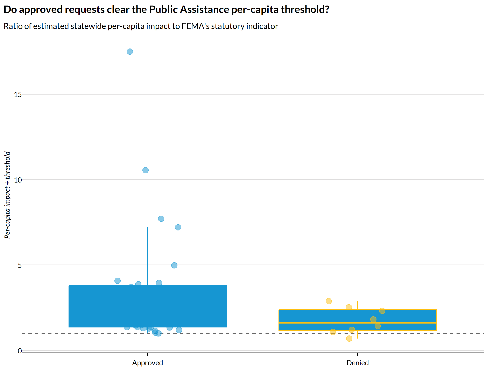
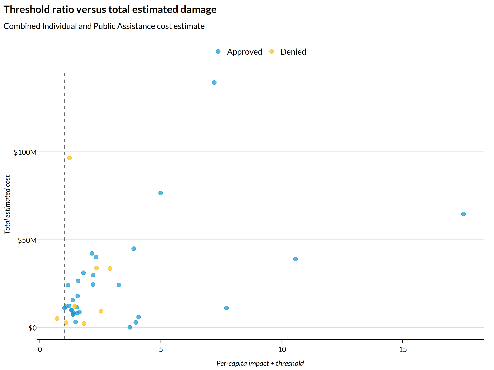

## Overview

When a state, territory, or tribal government believes an event exceeds its
capacity to respond, it requests a major disaster declaration from the
president. Before that request is granted or denied, FEMA and its partners
conduct a *preliminary damage assessment* (PDA) that estimates the scale of
the damage and compares it against the statutory thresholds FEMA uses to gauge
whether federal assistance is warranted.

`get_preliminary_damage_assessments()` extracts these estimates from the PDF
PDA reports FEMA publishes. On their own, the reports tell us what the damage
*looked like*; they do not tell us, in a structured way, whether the request
was ultimately approved or denied. This vignette closes that gap by joining the
PDAs to two authoritative FEMA datasets — the record of granted major disaster
declarations and the record of turned-down requests — so that each PDA carries
its official outcome. We then ask a simple question: **do the requests FEMA
approves actually clear the Public Assistance per-capita threshold, and do the
ones it denies fall short?**

## Data sources

| Role | Dataset | Access |
|---|---|---|
| Damage estimates | PDA reports | `climateapi::get_preliminary_damage_assessments()` |
| Approved requests | `DisasterDeclarationsSummaries` | OpenFEMA, via `rfema::open_fema()` |
| Denied requests | `DeclarationDenials` | OpenFEMA, via `rfema::open_fema()` |

The two FEMA datasets are *authoritative*: they are FEMA's own structured
records of what was declared and what was turned down. The PDAs, by contrast,
are text-extracted from unstructured PDFs and carry the caveats described in
`?get_preliminary_damage_assessments`. Treating the OpenFEMA records as the
source of truth for the outcome, and the PDAs as the source of the damage
estimates, plays to the strengths of each.


``` r
library(climateapi)
library(tidyverse)
library(urbnthemes)

set_urbn_defaults(style = "print")
```


``` r
## PDAs and approved declarations are restricted to requests filed after this
## year (i.e. 2025 onward). Denials use a one-year-wider window so that a request
## filed late in the prior year but denied inside the analysis window can still
## be matched to its PDA.
pda_min_year = 2024
denial_min_year = 2023
```

## Loading and preparing the PDAs

The PDA text names the affected state, so we recover it with a regex built from
every state and territory name. Names are ordered longest-first so that, for
example, "West Virginia" is preferred over the substring "Virginia" when both
could match at the same position.


``` r
states_match = tigris::fips_codes %>%
  distinct(state_name) %>%
  arrange(desc(str_length(state_name))) %>%
  pull(state_name) %>%
  str_c(collapse = "|")
```


``` r
pdas = get_preliminary_damage_assessments(use_cache = TRUE)
```


From each PDA we keep the fields needed for the join and the analysis: the
disaster number (the key for approved requests), the affected state, the
approve/deny decision parsed from the report, the determination date, the
per-capita impact figures, and the cost estimates.


``` r
pdas_recent = pdas %>%
  filter(year(event_date_determined) > pda_min_year) %>%
  mutate(
    ## the OpenFEMA disaster number is numeric; the PDA value is character and
    ## may be NA -- coerce both sides to character so the join keys are comparable
    disaster_number = as.character(disaster_number),
    ## a handful of PDA URLs carry a typo'd disaster number. The getter now
    ## re-derives most of these from the PDF text; these two remaining cases are
    ## corrected here as a belt-and-suspenders measure.
    disaster_number = case_when(
      disaster_number == "4653" ~ "4853",
      disaster_number == "4657" ~ "4857",
      TRUE ~ disaster_number),
    state = str_extract(text, states_match),
    pda_title = event_title %>%
      str_remove("Preliminary Damage Assessment Report") %>%
      ## group the alternation so this matches a literal "(State name)", not a
      ## bare state name (| binds looser than the surrounding parens otherwise)
      str_remove(str_c("\\((", states_match, ")\\)")) %>%
      str_remove("^\\s*[–-]\\s*") %>%
      str_squish(),
    decision = case_when(
      str_detect(event_type, "denial") ~ "Denied",
      str_detect(event_type, "approv") ~ "Approved"),
    ## a total damage estimate; 0 when neither program reported a cost
    cost_estimate_ia_pa_total = rowSums(
      cbind(pa_cost_estimate_total, ia_cost_estimate_total), na.rm = TRUE)) %>%
  ## drop PDAs whose state could not be recovered from the text -- they cannot be
  ## joined to the FEMA records by state
  filter(!is.na(state), !is.na(decision)) %>%
  select(
    disaster_number, decision, state, event_date_determined, pda_title,
    pa_per_capita_impact_statewide, pa_per_capita_impact_indicator_statewide,
    pa_cost_estimate_total, ia_cost_estimate_total, cost_estimate_ia_pa_total)
```

## Loading the authoritative FEMA outcomes

### Approved requests

`DisasterDeclarationsSummaries` returns one row per designated area (usually a
county), so a single declaration appears many times. We collapse to one row per
declaration string and translate the state abbreviation to a full name to match
the PDA state field.


``` r
declarations_raw = rfema::open_fema(
  data_set = "DisasterDeclarationsSummaries",
  ## major disaster declarations only
  filters = list(declarationType = "=DR"),
  ask_before_call = FALSE) %>%
  janitor::clean_names()

declarations = declarations_raw %>%
  filter(year(declaration_date) > pda_min_year) %>%
  distinct(fema_declaration_string, .keep_all = TRUE) %>%
  transmute(
    disaster_number = as.character(disaster_number),
    state,
    declaration_type,
    declaration_date = lubridate::as_date(declaration_date),
    declaration_title,
    decision = "Approved") %>%
  ## translate the state abbreviation to the full name used by the PDAs
  left_join(
    tigris::fips_codes %>% distinct(state_name, state),
    by = "state",
    relationship = "many-to-one") %>%
  select(-state) %>%
  rename(state = state_name)
```

### Denied requests

`DeclarationDenials` records requests FEMA turned down. Crucially, a denied
request never receives an official disaster number, so it cannot be joined on
that key — a fact that shapes the join strategy below. The state name is already
spelled out, and the request date stands in for the declaration date.


``` r
denials_raw = rfema::open_fema(
  data_set = "DeclarationDenials",
  ask_before_call = FALSE) %>%
  janitor::clean_names()

denials = denials_raw %>%
  filter(
    current_request_status == "Turndown",
    declaration_request_type == "Major Disaster",
    year(declaration_request_date) > denial_min_year) %>%
  transmute(
    state,
    declaration_date = lubridate::as_date(declaration_request_date),
    declaration_title = incident_name,
    decision = "Denied") %>%
  mutate(across(where(is.character), str_trim))
```

## Joining PDAs to their outcomes

The two outcomes require two different joins, because approvals and denials
carry different keys.

**Approved requests** share a disaster number with the declarations record, so
we join on `disaster_number`, `state`, and `decision` directly. The join is
many-to-one: a disaster may have more than one PDA (an original plus an
appeal), but only one authoritative declaration.


``` r
joined_approved = pdas_recent %>%
  filter(decision == "Approved") %>%
  left_join(
    declarations,
    by = c("disaster_number", "state", "decision"),
    relationship = "many-to-one") %>%
  mutate(matched = !is.na(declaration_date))
```

**Denied requests** have no disaster number to join on. Instead we match each
denied PDA to the turndown in the same state whose request date falls closest to
(and at or before) the PDA's determination date, using a rolling `join_by()`.
The PDA table is on the left so that the inequality reads in the natural
direction (`event_date_determined >= declaration_date`).


``` r
joined_denied = pdas_recent %>%
  filter(decision == "Denied") %>%
  left_join(
    denials,
    by = join_by(
      state,
      decision,
      closest(event_date_determined >= declaration_date)),
    relationship = "many-to-one") %>%
  mutate(matched = !is.na(declaration_date)) %>%
  ## one turndown in this window is a train-derailment request: not a natural
  ## hazard and not a substantive PDA, so we exclude it from the comparison
  filter(is.na(declaration_title) | !str_detect(declaration_title, regex("train", ignore_case = TRUE)))
```

### Did the join succeed?

Before analyzing the joined data, we confirm that the PDAs actually matched an
authoritative FEMA record. A low match rate would mean our outcome labels are
unreliable.


``` r
pda_outcomes = bind_rows(joined_approved, joined_denied)

pda_outcomes %>%
  count(decision, matched) %>%
  pivot_wider(names_from = matched, values_from = n, names_prefix = "matched_", values_fill = 0)
#> # A tibble: 2 × 2
#>   decision matched_TRUE
#>   <chr>           <int>
#> 1 Approved           41
#> 2 Denied             13
```

## Analysis: does the per-capita threshold predict the outcome?

FEMA's Public Assistance program compares a jurisdiction's estimated per-capita
damage against a statutory per-capita *indicator* (a dollar threshold that is
updated annually). We express each PDA as the ratio of the two: a value above
1.0 means the estimated damage exceeded the threshold.


``` r
pda_outcomes = pda_outcomes %>%
  mutate(
    pa_threshold_ratio =
      pa_per_capita_impact_statewide / pa_per_capita_impact_indicator_statewide)
```

If the threshold drove the decision, approved requests would sit above the line
and denials below it.


``` r
pda_outcomes %>%
  filter(!is.na(pa_threshold_ratio)) %>%
  ggplot(aes(x = decision, y = pa_threshold_ratio, color = decision)) +
  geom_hline(yintercept = 1, linetype = "dashed", color = "grey40") +
  geom_boxplot(outlier.shape = NA) +
  geom_jitter(width = 0.15, alpha = 0.5) +
  labs(
    title = "Do approved requests clear the Public Assistance per-capita threshold?",
    subtitle = "Ratio of estimated statewide per-capita impact to FEMA's statutory indicator",
    x = NULL,
    y = "Per-capita impact ÷ threshold") +
  theme(legend.position = "none")
```



The relationship is imperfect, which is the point: the per-capita indicator is
one input among several (insurance coverage, localized impacts, prior-year
disaster burden), so some sub-threshold requests are approved and some
above-threshold requests are denied. Plotting the ratio against the total cost
estimate shows how the two dimensions interact.


``` r
pda_outcomes %>%
  filter(!is.na(pa_threshold_ratio), cost_estimate_ia_pa_total > 0) %>%
  ggplot(aes(
    x = pa_threshold_ratio,
    y = cost_estimate_ia_pa_total,
    color = decision)) +
  geom_vline(xintercept = 1, linetype = "dashed", color = "grey40") +
  geom_point(alpha = 0.7, size = 2) +
  scale_y_continuous(
    labels = scales::label_dollar(scale_cut = scales::cut_short_scale())) +
  labs(
    title = "Threshold ratio versus total estimated damage",
    subtitle = "Combined Individual and Public Assistance cost estimate",
    x = "Per-capita impact ÷ threshold",
    y = "Total estimated cost",
    color = "Decision")
```



## Caveats

- **State recovery is best-effort.** The affected state is extracted from free
  text and is set to the first state name that appears; a report that mentions a
  neighboring state first could be mislabeled. PDAs with no recoverable state are
  dropped before the join.
- **Denied requests are matched by date, not by key.** Because turndowns lack a
  disaster number, the denied join relies on a closest-date heuristic within a
  state. Two denials close together in time in the same state could be matched
  imperfectly.
- **`disaster_number` reliability.** For FEMA's newest filename convention
  (`FY25…`, `FY26…`), the disaster number is recovered from the PDF body rather
  than the filename; see `?get_preliminary_damage_assessments` for details.
- **Per-capita fields are text-extracted.** The `pa_per_capita_impact_*`
  fields come from parsing PDFs and can be missing or malformed for individual
  reports; rows with missing values are excluded from the plots.

## See also

- `get_preliminary_damage_assessments()`: the PDA extraction itself
- `get_fema_disaster_declarations()`: FEMA disaster declarations
- `get_public_assistance()`: obligated Public Assistance funding
- `get_ihp_registrations()`: Individual and Households Program registrations
